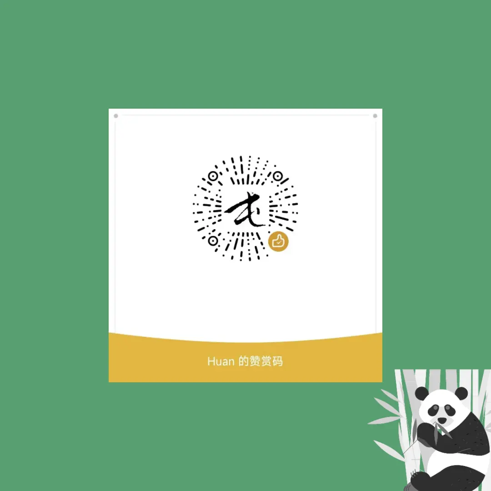

  

  
  
  
  
  
  
  

## 歪脖子新标签页

> 一款可以预防颈椎病的新标签页扩展。

### 安装

- [chrome web store](https://chrome.google.com/webstore/detail/%E6%AD%AA%E8%84%96%E5%AD%90%E6%96%B0%E6%A0%87%E7%AD%BE%E9%A1%B5/ackimleclkemolnfcfajficenpbnaiba)
- [Add-ons for Firefox](https://addons.mozilla.org/en-US/firefox/addon/%E6%AD%AA%E8%84%96%E5%AD%90%E6%96%B0%E6%A0%87%E7%AD%BE%E9%A1%B5/)
- [离线安装包](https://github.com/dukeluo/wai/releases)
- [在线体验](https://wai.shaiwang.life/)

### 功能

- 活动脖子，预防颈椎病
- 三种模式支持，强度自己选择
- 休息日指南，快速知晓下一个休息日
- 当季蔬果提示，健康饮食每一天
- 历史上的今天，回顾历史长河

#### 工作模式

- 柔和模式：每次触发时内容小范围摆动，标题和主体不颠倒展示
- 连续模式：标题和主体不颠倒展示，每隔 4s 自动左右摆动
- 全面模式：每次触发时内容随机角度摆动，标题和主体颠倒展示，为插件默认模式

### 鸣谢

歪脖子新标签页的诞生离不开以下资源的帮助，特感谢以下资源的提供：

- 本应用图标由<a href="https://pixabay.com/zh/users/openclipart-vectors-30363/?utm_source=link-attribution&amp;utm_medium=referral&amp;utm_campaign=image&amp;utm_content=147345"> OpenClipart-Vectors </a>在<a href="https://pixabay.com/zh/?utm_source=link-attribution&amp;utm_medium=referral&amp;utm_campaign=image&amp;utm_content=147345"> Pixabay </a>上发布。
- 休息日指南由[免费节假日 API ](https://timor.tech/api/holiday)强力驱动。
- 当季蔬果的数据来自知乎「一年 12 个月对应的应季时令水果蔬菜有哪些？」中[果蔬百科的回答](https://www.zhihu.com/question/21026884/answer/243125996)。
- 历史上的今天的数据来自维基百科[历史上的今天](https://zh.m.wikipedia.org/zh-cn/%E5%8E%86%E5%8F%B2%E4%B8%8A%E7%9A%84%E4%BB%8A%E5%A4%A9)。

### 支持作者

### 其他

- [「歪脖子新标签页」讨论吐槽区](https://github.com/dukeluo/wai/discussions)
- [「歪脖子新标签页」开发计划](https://github.com/users/dukeluo/projects/2)
- [「歪脖子新标签页」 Issue 列表](https://github.com/dukeluo/wai/issues)
